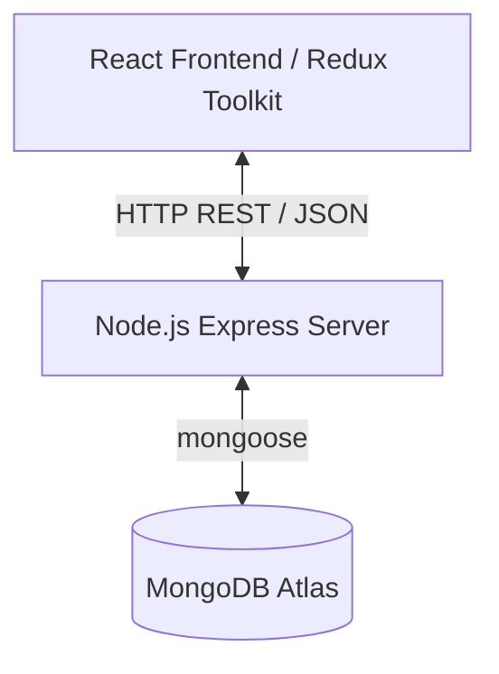

# Callback: AI-Powered Technical Mock Interview Platform

Welcome to the documentation for **Callback**. Callback is a technical mock interview simulator designed to help software engineers, DevOps/SREs, data engineers, and ML specialists practice realistic panel-style technical interviews.

---

## 1. Product Overview

Callback bridges the gap between passive studying (reading questions/watching videos) and the high-pressure environment of a live engineering loop. The platform's frontend provides a landing experience where users can select paths and preview how a mock interview session runs.

---

## 2. Core Features (Frontend Concept)

### 📅 Track Selection
Users can select from several interview tracks:
- **Backend Engineering**
- **Frontend Engineering**
- **DevOps / SRE**
- **Data Engineering**
- **ML / AI**
- **System Design**
- **Behavioral**

### 📊 Performance Scorecard Concept
The application aims to evaluate:
- **Pace (WPM):** Speeds in words-per-minute.
- **Filler Count:** Detects verbal crutches like `"um"`, `"uh"`, `"like"`, etc.
- **Structure (STAR Method):** Validates if response follows the Situation, Task, Action, Result framework.
- **Technical Depth:** Evaluates if the answers had sufficient engineering depth or stayed surface-level.

---

## 3. System Architecture & Tech Stack



### Frontend
- **Framework:** React 18+ (Vite)
- **State Management:** Redux Toolkit (`store/uiSlice.js`)
- **Styling:** Tailwind CSS (configured in `tailwind.config.js` with dark mode palettes)
- **Typography:** Space Grotesk (display headings) & IBM Plex Sans/Mono (text/code)

### Backend (Express)
- **Framework:** Express (Node.js using ES Modules)
- **Database:** MongoDB Atlas via Mongoose
- **Validation:** Input parsing using **Zod**
- **Authentication:** JSON Web Tokens (JWT) stored in HTTP-Only cookies and authorization headers
- **Middlewares:** Helmet, CORS, Morgan, Express JSON/URLEncoded parser.

---

## 4. Repository Layout

```text
callback/
├── docs/                   # Product & Architecture Documentation
│   ├── backend/
│   └── frontend/
├── backend/                # Express Server Directory
│   ├── src/
│   │   ├── config/         # Database Connections (db.js)
│   │   ├── repository/     # Database Queries (user.repository.js)
│   │   ├── validations/    # Input Validations (auth.validation.js)
│   │   ├── controllers/    # API Route Logic (auth.controller.js)
│   │   ├── models/         # MongoDB Schemas (user.model.js)
│   │   ├── routes/         # Router declarations (auth.routes.js, routes.js)
│   │   ├── utils/          # Helpers (asyncHandler.js, bcrypt.utility.js, jwt.utility.js)
│   │   ├── app.js          # Express app configuration (CORS, Middlewares, API mounting)
│   │   └── server.js       # Entry point / server initialization
│   ├── .env.example        # Reference environment configuration
│   └── package.json
└── frontend/               # React client directory
    ├── src/
    │   ├── assets/
    │   ├── components/     # Presentation components (Hero, Navbar, Tracks, HowItWorks, etc.)
    │   ├── store/          # Redux Toolkit setup (index.js, uiSlice.js)
    │   ├── App.css
    │   ├── App.jsx         # App structure
    │   ├── index.css       # Tailwind base, components, utility overrides
    │   └── main.jsx        # App mounting point
    ├── tailwind.config.js  # Styling configurations
    └── package.json
```

---

## 5. API Reference (Authentication)

All version 1 API endpoints are versioned and mounted under the `/api/v1/` prefix.

### Endpoints

#### 1. User Signup
* **Route:** `POST /api/v1/auth/signup`
* **Request Body:**
  ```json
  {
    "username": "john_doe",
    "email": "john@example.com",
    "firstname": "John",
    "lastname": "Doe",
    "password": "secure_password_123"
  }
  ```
* **Response (201 Created):**
  ```json
  {
    "success": true,
    "message": "User registered successfully",
    "user": {
      "_id": "64b3ef8e1329c2ab87dc4612",
      "username": "john_doe",
      "email": "john@example.com",
      "firstname": "John",
      "lastname": "Doe",
      "role": "user",
      "createdAt": "2026-07-31T19:06:50.000Z",
      "updatedAt": "2026-07-31T19:06:50.000Z"
    },
    "token": "eyJhbGciOiJIUzI1NiIsInR5cCI6IkpXVCJ9..."
  }
  ```
  *Note: Sets an HTTP-Only cookie `token` in the browser.*

#### 2. User Login
* **Route:** `POST /api/v1/auth/login`
* **Request Body:**
  ```json
  {
    "email": "john@example.com",
    "password": "secure_password_123"
  }
  ```
* **Response (200 OK):**
  ```json
  {
    "success": true,
    "message": "Logged in successfully",
    "user": {
      "_id": "64b3ef8e1329c2ab87dc4612",
      "username": "john_doe",
      "email": "john@example.com",
      "firstname": "John",
      "lastname": "Doe",
      "role": "user",
      "createdAt": "2026-07-31T19:06:50.000Z",
      "updatedAt": "2026-07-31T19:06:50.000Z"
    },
    "token": "eyJhbGciOiJIUzI1NiIsInR5cCI6IkpXVCJ9..."
  }
  ```
  *Note: Sets an HTTP-Only cookie `token` in the browser.*

---

## 6. Local Setup & Running Instructions

### Backend Setup
1. Navigate to backend:
   ```bash
   cd callback/backend
   ```
2. Install dependencies:
   ```bash
   npm install
   ```
3. Create `.env` file (based on `.env.example`):
   ```bash
   cp .env.example .env
   ```
4. Start development server:
   ```bash
   npm run dev
   ```
   *The server runs by default on port `5000` (http://localhost:5000).*

### Frontend Setup
1. Navigate to frontend:
   ```bash
   cd callback/frontend
   ```
2. Install dependencies:
   ```bash
   npm install
   ```
3. Start development server:
   ```bash
   npm run dev
   ```
   *The client runs by default on port `5173` (http://localhost:5173).*
