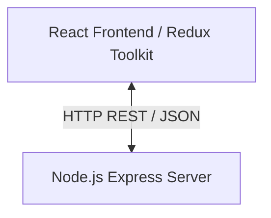

# Callback: AI-Powered Technical Mock Interview Platform

Welcome to the documentation for **Callback**. Callback is a technical mock interview simulator design to help software engineers, DevOps/SREs, data engineers, and ML specialists practice realistic panel-style technical interviews. 

> [!NOTE]
> All pre-existing backend APIs, mock interview endpoints, and dynamic AI evaluation logic have been removed from the backend to establish a clean, skeleton codebase. Developers or AI assistants can design and build new endpoints from scratch.

---

## 1. Product Overview

Callback bridges the gap between passive studying (reading questions/watching videos) and the high-pressure environment of a live engineering loop. The platform's frontend provides a landing experience where users can select paths and preview how a mock interview session runs.

---

## 2. Core Features (Frontend Concept)

### 📅 Track Selection
Users can select from several interview tracks:
- **Backend Engineering**
- **Frontend Engineering**
- **DevOps / SRE**
- **Data Engineering**
- **ML / AI**
- **System Design**
- **Behavioral**

### 📊 Performance Scorecard Concept
The application aims to evaluate:
- **Pace (WPM):** Speeds in words-per-minute.
- **Filler Count:** Detects verbal crutches like `"um"`, `"uh"`, `"like"`, etc.
- **Structure (STAR Method):** Validates if response follows the Situation, Task, Action, Result framework.
- **Technical Depth:** Evaluates if the answers had sufficient engineering depth or stayed surface-level.

---

## 3. System Architecture & Tech Stack



### Frontend
- **Framework:** React 18+ (Vite)
- **State Management:** Redux Toolkit (`store/uiSlice.js`)
- **Styling:** Tailwind CSS (configured in `tailwind.config.js` with dark mode palettes)
- **Typography:** Space Grotesk (display headings) & IBM Plex Sans/Mono (text/code)

### Backend (Skeleton)
- **Framework:** Express (Node.js using ES Modules)
- **Middlewares:** Helmet, CORS, Morgan, Express JSON/URLEncoded parser.
- **Database (Unused):** Mongoose models are available but not connected to any routes.

---

## 4. Repository Layout

```text
callback/
├── docs/                   # Product & Architecture Documentation
│   ├── backend/
│   └── frontend/
├── backend/                # Express Server Directory (Skeleton)
│   ├── src/
│   │   ├── config/         # Database Connections (db.js)
│   │   ├── controllers/    # Deprecated/Removed (empty)
│   │   ├── models/         # MongoDB Schemas (Interview.js)
│   │   ├── routes/         # Deprecated/Removed (empty)
│   │   ├── services/       # Deprecated/Removed (empty)
│   │   ├── utils/          # Helper middleware (asyncHandler.js)
│   │   ├── app.js          # Express app configuration (No active API routes)
│   │   └── server.js       # Entry point / server initialization
│   ├── .env.example        # Reference environment configuration
│   └── package.json
└── frontend/               # React client directory
    ├── src/
    │   ├── assets/
    │   ├── components/     # Presentation components (Hero, Navbar, Tracks, HowItWorks, etc.)
    │   ├── store/          # Redux Toolkit setup (index.js, uiSlice.js)
    │   ├── App.css
    │   ├── App.jsx         # App structure
    │   ├── index.css       # Tailwind base, components, utility overrides
    │   └── main.jsx        # App mounting point
    ├── tailwind.config.js  # Styling configurations
    └── package.json
```

---

## 5. Local Setup & Running Instructions

### Backend Setup
1. Navigate to backend:
   ```bash
   cd callback/backend
   ```
2. Install dependencies:
   ```bash
   npm install
   ```
3. Create `.env` file (based on `.env.example`):
   ```bash
   cp .env.example .env
   ```
4. Start development server:
   ```bash
   npm run dev
   ```
   *The server runs by default on port `5000` (http://localhost:5000) with a 404 handler for all endpoints.*

### Frontend Setup
1. Navigate to frontend:
   ```bash
   cd callback/frontend
   ```
2. Install dependencies:
   ```bash
   npm install
   ```
3. Start development server:
   ```bash
   npm run dev
   ```
   *The client runs by default on port `5173` (http://localhost:5173).*
